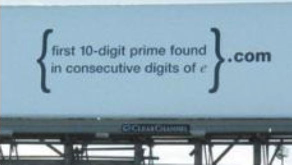

Google Billboard
==================
In July of 2004 a mysterious billboard appeared in Silicon Valley. All it said was  



At the same time, an identical banner appeared in the Harvard Square subway station in Boston. 


No indication was given about the significance of the signs, but people who correctly discovered the ten digit prime and visited the website were given a subsequent second puzzle. If they completed the second puzzle correctly they received a congratulatory message encouraging them to apply for a job at Google Labs!  This promotion is no longer active, but we will replicate the experience here as a means to learn usage of Java Boolean & String objects. This is an important and frequently needed construct.  It also appears often in the APCSA exam!

Suggested steps to complete the puzzle of the Goolge Billboard
--------------------------------------------------------------
1. Go to [Codingbat isPrime](https://codingbat.com/prob/p221207?parent=/home/chandru.narayan@bush.edu/googlebillboard), **log in**, and do the **isPrime** problem
2. You may also find the first ~50 slides of the [Unit_2_String_Objects_Methods](https://docs.google.com/presentation/d/1H9tzGeTWetjzUz1G450NGxbEO5xZl3BvacfkFWsvWRE/edit#slide=id.p1) helpful
3. Now you are ready to start this project. Fork and clone down this repository
3. In `setup()` use the two argument version of `substring()` to pull out ten consecutive digits of e at a time. Convert them to `double`s with `Double.parseDouble()`. Here's an example:  
     `String digits = e.substring(2,12);`   
     `double dNum = Double.parseDouble(digits);`   
     `System.out.println(dNum);  //displays 7.182818284E9`  
Note that by default, Java displays doubles in exponential form. `7.182818284E9` is 7.182818284 x 10^9.
5. Finish the codingbat `isPrime()`  to test if a number is prime. 
6. Add a loop to `setup()` that moves through the digits of e until it finds the first 10 digit prime.
7. Add commit and upload your finished program to your github account. 
9. OPTIONAL: If you have extra time you may want to see if you can solve the second puzzle to get the 5th pattern formed by consecutive digits of `e`!  (Hint: the individual digits in each pattern add up to 49!).

````
Expected Output:
Puzzle 1:
first 10-digit prime found in consecutive digits of 'e': 7427466391
Puzzle 2:
f(1)= 7182818284
f(2)= 8182845904
f(3)= 8747135266
f(4)= 7427466391
f(5)= 5966290435
````
